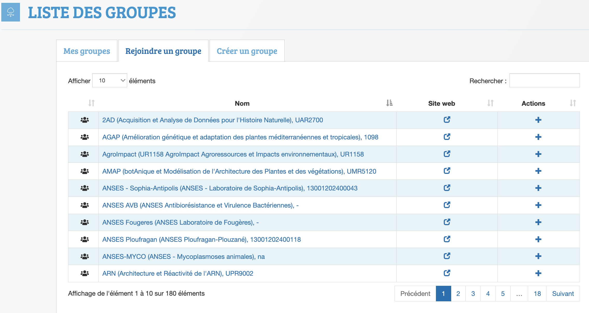

The first action to sign in to Biosphere is to click on the menu [**"Sign in"**](https://biosphere.france-bioinformatique.fr/cloudweb/login/?next=/)
 in the top-right corner of the main page of the Biopshere portal, and then follow the guidelines. you will first create your account, and then request to activate it by joining a valid group corresponding to your  affiliation/project/training. You can also join other groups afterwards according to your situation.

### 1. Create your account
 
 Two options are available to create an account, use your academic credentials from your academic employer (**using federated identity is recommended for better security**), or create an account based on your email.

* **Federated identity**

We advise to use your usual academic credentials in eduGAIN where most of European universities and academic organisms are registered ([more details about eduGAIN there](https://edugain.org)). 
Biosphere will use automatically your email address and other personnal information that you authorised to transmit. 

!!! info

    **In case your institution is not registered in eduGAIN, you can ask for a local Biosphere account.**

* **Local Biosphere account**

You will have to fill the required information by hand. Especially, **take care of the email address** you enter because it will be use to contact you for any inquiry or announcement related to IFB-Biosphere.
For example, at the second step of the account request, an email message will be sent to this email address to confirm it.
**In case you have not anymore access to this email address, we will not be able to join you or help you to keep access to your Biosphere cloud account.**

### 2. Join a group

Once your account is created, you will be asked to apply to your affiliation/project/training group.

{ width="500", align=right }

1. Go to the [Biosphere Groups page](https://biosphere.france-bioinformatique.fr/cloudweb_account/groups).
2. Select the tab "Join a group".
3. Search your group with the top-right field.
4. Apply to join it.

!!! Note

    If your affiliation is not already registered, you may ask to create it in the tab "Add a group"

!!! Warning "Attention"

    **Both your request for an account and for the membership to an affiliation will be evaluate by the IFB committee before validation.**
    Take care when you fill these two steps because it will help to keep the validation process going. In case of a clarification need, you will be contacted on the email address you enter. 
