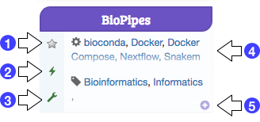

## Deploy your virtual machines

Different pre-defined bioinformatics environments ('appliances') are available from the [RAINBio](https://biosphere.france-bioinformatique.fr/catalogue) catalogue. You can deploy your own virtual environment with a single VM or several. To identify the relevant appliances, you can filter the available ones with keywords, name of tools or topics (use the search field in the top-right corner of the page).

Each appliance is shortly described in a box, like in the following exampleof the `BioPipes`app.

{ width="500", align=right }

The list of integrated tools and associated topics are summarized in the box {==[4]==}.

Several actions are directly usable through the following icons: 
- {==[1]==} 'star': to record it in your favorites, 
- {==[2]==} 'lightning': to start the app quickly with the default parameters (`default cloud`, `default size` in your user profile), 
- {==[3]==} 'wrench': to configure your deployment, for example to change the cloud to use and the size of the VM, 
- {==[5]==} '+': to display an detailled view of the appliance (you can also click on the name of the appliance).
